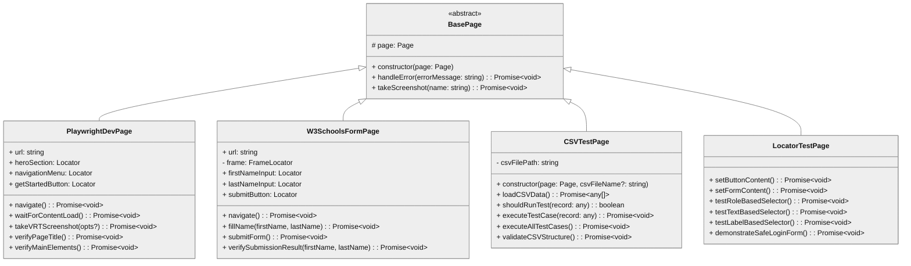
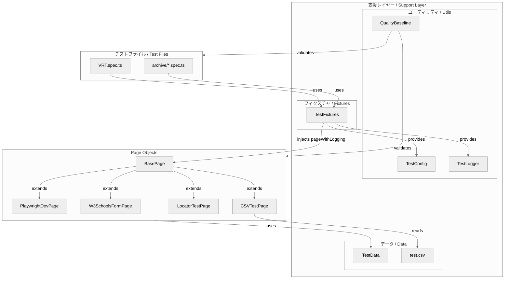
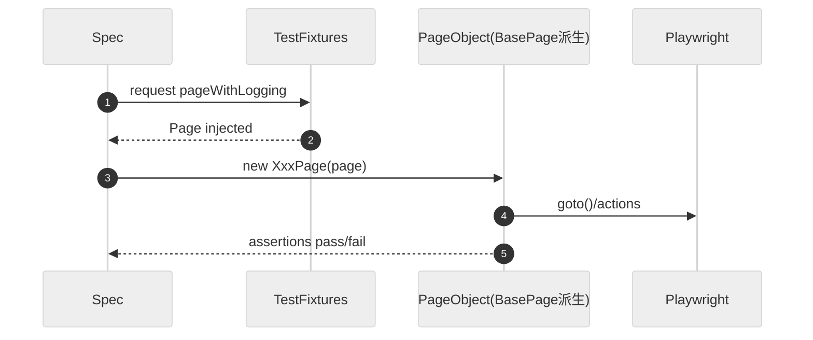

# Page Object Model アーキテクチャ / POM Architecture

このドキュメントは、当リポジトリのPage Object Model構造に焦点を当てた設計図です。

## 1. クラス構造 / Class Structure (実装ベース)

## 2. 責務分担 / Responsibilities
- **BasePage**: 共通基盤（エラーハンドリング、スクショ）
- **各Page**: セレクター戦略遵守、ドメイン操作の集約
- **Fixtures**: 認証済みコンテキスト、ロギング、設定の注入

## 3. シーケンス: 典型操作 / Sequence: Typical Operations

**更新時は実装ファイルとの整合性を最優先で維持してください。**
