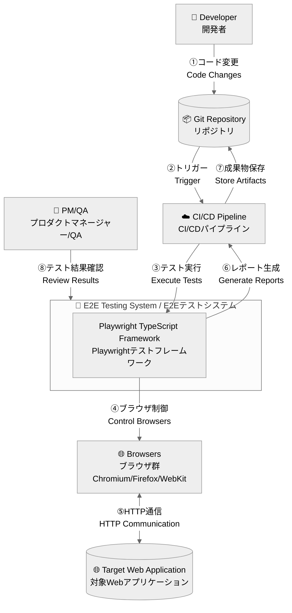
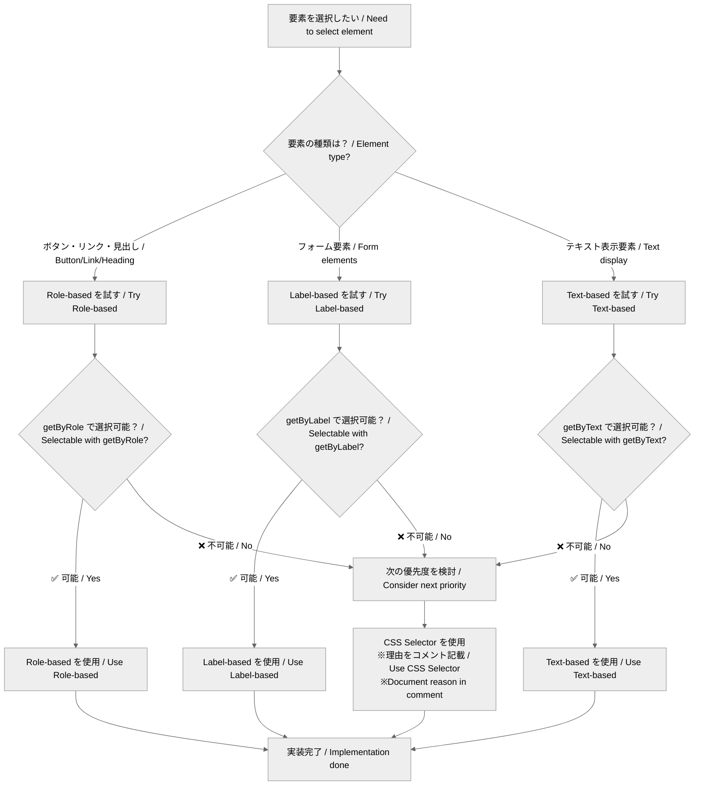

# アーキテクチャ図 / Architecture Diagrams

以下はMermaidを埋め込んだMarkdownです。GitHubやエディタのMermaidプレビュー機能で閲覧できます。

## C4 Context / コンテキスト図
システム全体の境界と外部との関係を示します。

## Selector Strategy Flow / セレクター戦略フロー

### POM 図 / POM Diagrams
- Page Object Modelに特化した詳細図は `docs/architecture/POM.md` を参照

