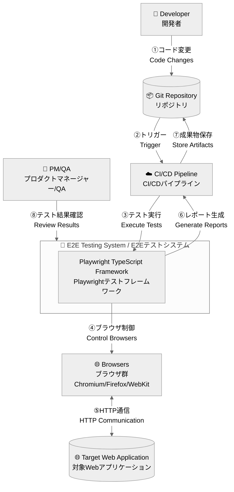
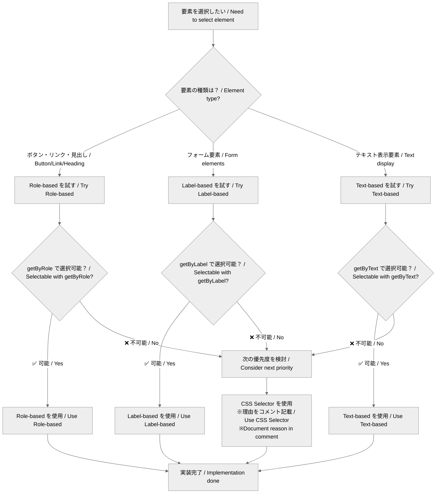
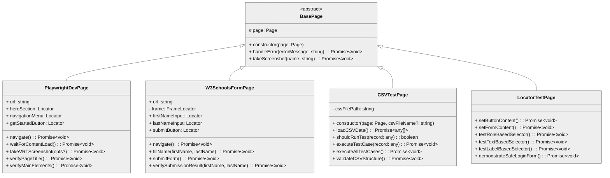
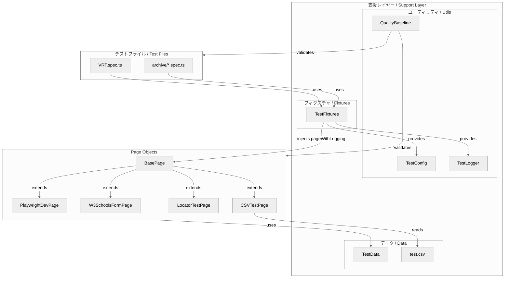
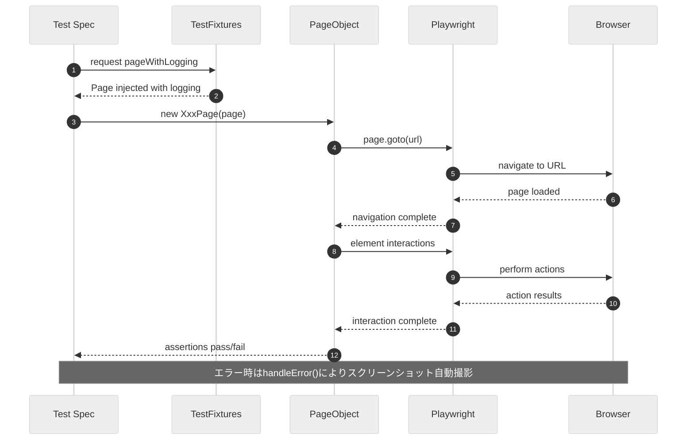
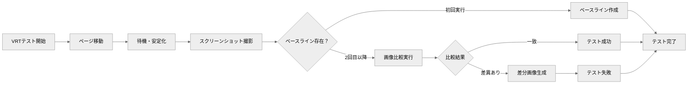
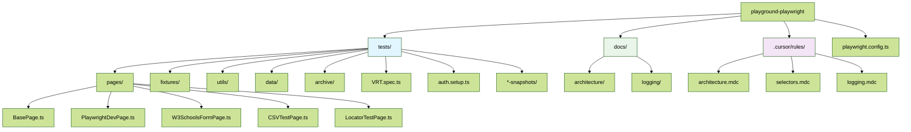

# アーキテクチャ図表集 / Architecture Diagrams Collection

このドキュメントは、プロジェクトのアーキテクチャを視覚的に表現するMermaid図表集です。

This document is a collection of Mermaid diagrams that visually represent the project architecture.

## 🏗️ システム全体図 / System Overview

### C4 Context / コンテキスト図
システム全体の境界と外部との関係を示します。

## 🎯 セレクター戦略フロー / Selector Strategy Flow

要素選択の判断フローを示します。

## 🏗️ Page Object Model構造 / POM Structure

### クラス継承図 / Class Inheritance Diagram

### 責務分担図 / Responsibility Distribution

## 🔄 テスト実行シーケンス / Test Execution Sequence

### 典型的なテスト実行フロー / Typical Test Execution Flow

### VRT（Visual Regression Testing）フロー / VRT Flow

## 📁 ディレクトリ構造図 / Directory Structure Diagram

## 🔗 参考情報 / References

### 関連ルールファイル / Related Rule Files
- **[🏗️ architecture.mdc](../../.cursor/rules/architecture.mdc)** - Page Object Model基本ルール
- **[🎯 selectors.mdc](../../.cursor/rules/selectors.mdc)** - セレクター戦略ルール
- **[📊 logging.mdc](../../.cursor/rules/logging.mdc)** - ログシステムルール

### 実装ファイル / Implementation Files
- **[tests/pages/BasePage.ts](../../tests/pages/BasePage.ts)** - 基底クラス実装
- **[tests/fixtures/TestFixtures.ts](../../tests/fixtures/TestFixtures.ts)** - テストフィクスチャ

---

**📝 更新履歴 / Update History**
- v1.0.0: 初期図表集作成 (2025-01-23) / Initial diagrams collection creation
- 最終更新 / Last updated: 2025-01-23

**注意 / Note**: 実装ファイルとの整合性を最優先で維持してください。図表は実装の変更に合わせて更新が必要です。
