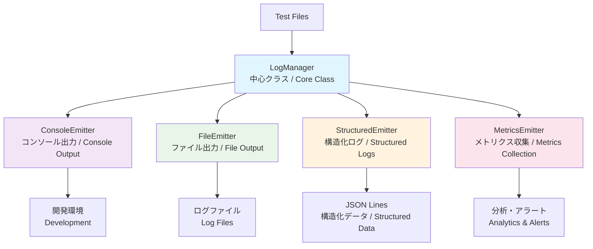

# 🚀 ログシステム設計ドキュメント / Logging System Design Documentation

## 📊 概要 / Overview

Playwright TypeScript E2Eテスト環境向けの本格的なログシステムの設計ドキュメントです。開発から本番運用まで、あらゆる環境で高品質なログ管理を実現します。

This is the design documentation for a professional logging system for Playwright TypeScript E2E testing environments. It provides high-quality log management across all environments from development to production.

## 🏗️ システム構成 / System Architecture

### アーキテクチャ概要 / Architecture Overview



## 📚 ドキュメント構成 / Documentation Structure

| ドキュメント / Document                                  | 内容 / Content                                                              | 対象読者 / Target Audience                     |
| -------------------------------------------------------- | --------------------------------------------------------------------------- | ---------------------------------------------- |
| **[📖 README.md](README.md)**                             | システム概要、ナビゲーション / System overview, navigation                  | 全員 / Everyone                                |
| **[🏗️ log-architecture.md](log-architecture.md)**         | アーキテクチャ設計、技術選択理由 / Architecture design, technical decisions | 開発者・アーキテクト / Developers & Architects |
| **[💡 implementation-guide.md](implementation-guide.md)** | 実装ガイド、ベストプラクティス / Implementation guide, best practices       | 実装者 / Implementers                          |

## 🎯 主要特徴 / Key Features

### ✨ **プラガブル設計 / Pluggable Design**
- Emitterパターンによる出力先の動的制御 / Dynamic output control via Emitter pattern
- 環境別設定の自動適用 / Automatic environment-specific configuration
- TypeScript型安全性による堅牢性 / Robustness through TypeScript type safety

### 📈 **構造化ログ / Structured Logging**
- JSON Lines形式での高効率出力 / High-efficiency output in JSON Lines format
- インデックス機能による高速検索 / Fast search via indexing functionality
- メトリクス自動収集・分析 / Automatic metrics collection and analysis

### 🔄 **運用対応 / Production-Ready**
- 自動ローテーション・圧縮 / Automatic rotation and compression
- リアルタイム監視・アラート / Real-time monitoring and alerts
- 機密情報の自動マスキング / Automatic sensitive data masking

## 🚀 クイックスタート / Quick Start

### 基本的な使用方法 / Basic Usage

```typescript
import { initializeLoggingSystem } from '../tests/utils/logging';

// ログシステム初期化 / Initialize logging system
const logger = await initializeLoggingSystem({
  level: LogLevel.INFO,
  enableConsole: true,
  enableFile: true
});

// 基本的なログ出力 / Basic logging
logger.info('テスト開始 / Test started');
logger.error('エラーが発生 / Error occurred', LogCategory.ERROR_HANDLING);
```

### テスト統合例 / Test Integration Example

**📋 Given-When-Thenパターン統合 / GWT Pattern Integration**

必須のテスト統合パターンは **[📊 logging.mdc](../../.cursor/rules/logging.mdc#テスト統合ルール--test-integration-rules)** を参照してください。

For mandatory test integration patterns, refer to **[📊 logging.mdc](../../.cursor/rules/logging.mdc#テスト統合ルール--test-integration-rules)**.

## 🔧 環境別設定 / Environment Configuration

**📋 環境別設定ルール / Environment Configuration Rules**

詳細な環境別設定ルールは **[📊 logging.mdc](../../.cursor/rules/logging.mdc#環境別設定ルール--environment-configuration-rules)** を参照してください。

For detailed environment configuration rules, refer to **[📊 logging.mdc](../../.cursor/rules/logging.mdc#環境別設定ルール--environment-configuration-rules)**.

## 📁 ファイル構造 / File Structure

```
tests/utils/logging/               # 実装ディレクトリ / Implementation directory
├── README.md                     # 詳細API仕様 / Detailed API specifications
├── index.ts                      # メインエクスポート / Main exports
├── types.ts                      # 型定義 / Type definitions
├── LogManager.ts                 # コア管理クラス / Core management class
├── LogConfigFactory.ts           # 設定ファクトリ / Configuration factory
├── emitters/                     # 出力Emitter群 / Output emitters
│   ├── ConsoleEmitter.ts         # コンソール出力 / Console output
│   ├── FileEmitter.ts            # ファイル出力 / File output
│   ├── StructuredEmitter.ts      # 構造化ログ / Structured logging
│   └── MetricsEmitter.ts         # メトリクス収集 / Metrics collection
├── examples/                     # 使用例 / Usage examples
├── integration/                  # 統合ガイド / Integration guides
└── monitoring/                   # 監視設定 / Monitoring setup

docs/logging/                     # 設計ドキュメント / Design documentation
├── README.md                     # このファイル / This file
├── log-architecture.md           # アーキテクチャ設計 / Architecture design
└── implementation-guide.md       # 実装ガイド / Implementation guide
```

## 🔗 関連リンク / Related Links

### 📖 設計ドキュメント / Design Documents
- **[🏗️ アーキテクチャ設計](log-architecture.md)** - 技術選択理由と設計原則 / Technical decisions and design principles
- **[💡 実装ガイド](implementation-guide.md)** - コード例とベストプラクティス / Code examples and best practices

### 🔧 実装ファイル / Implementation Files
- **[📋 詳細API仕様](../../tests/utils/logging/README.md)** - 完全なAPI リファレンス / Complete API reference
- **[⚙️ 型定義](../../tests/utils/logging/types.ts)** - TypeScript型定義 / TypeScript type definitions
- **[🎛️ 設定ファクトリ](../../tests/utils/logging/LogConfigFactory.ts)** - 環境別設定管理 / Environment-specific configuration

### 🧪 統合例 / Integration Examples
- **[📝 VRTテスト統合](../../tests/utils/logging/integration/VRT-Integration-Guide.md)** - Visual Regression Testing統合 / VRT integration
- **[🎯 BasePage統合](../../tests/utils/logging/integration/BasePage-Design-for-Logs.md)** - Page Object Model統合 / POM integration

## 🤝 コントリビューション / Contributing

### 📋 ドキュメント更新時の注意点 / Documentation Update Guidelines

1. **日英併記の維持 / Maintain bilingual format**
   - 形式: `日本語 / English` / Format: `Japanese / English`
   - 技術用語の統一 / Consistent technical terminology

2. **実用性重視 / Focus on practicality**
   - 実際のコード例を含める / Include actual code examples
   - トラブルシューティング情報を充実 / Comprehensive troubleshooting

3. **設計原則の遵守 / Adhere to design principles**
   - プラガブル設計の維持 / Maintain pluggable design
   - 型安全性の重視 / Emphasize type safety
   - パフォーマンス考慮 / Performance considerations

## 📞 サポート / Support

### 🔍 問題解決 / Troubleshooting
- **設定問題**: [implementation-guide.md](implementation-guide.md#troubleshooting) を参照 / For configuration issues, refer to implementation guide
- **パフォーマンス問題**: [log-architecture.md](log-architecture.md#performance) を参照 / For performance issues, refer to architecture guide
- **統合問題**: [integration/](../../tests/utils/logging/integration/) ディレクトリを参照 / For integration issues, refer to integration directory

### 📈 機能要望・バグ報告 / Feature Requests & Bug Reports
- **GitHub Issues**: バグ報告・機能要望 / Bug reports and feature requests
- **プロジェクトFAQ**: [docs/architecture/project-faq.md](../architecture/project-faq.md) / Project FAQ

---

**📝 更新履歴 / Update History**
- v1.0.0: 初期ドキュメント作成 (2025-01-23) / Initial documentation creation
- 最終更新 / Last updated: 2025-01-23
