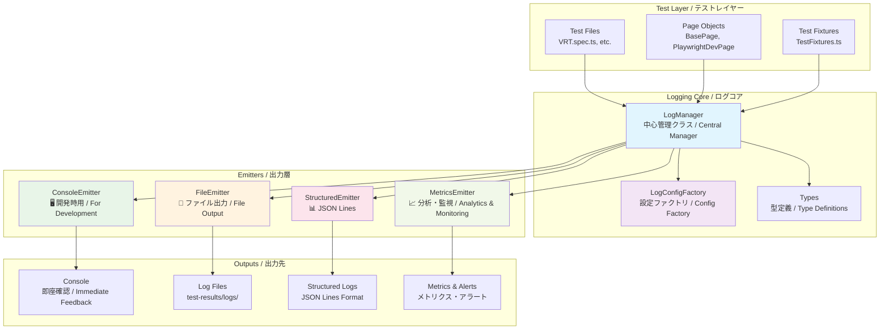
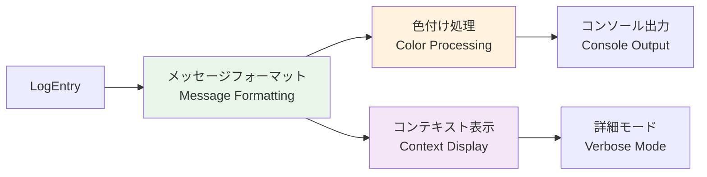
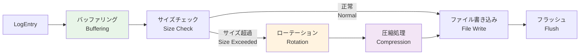
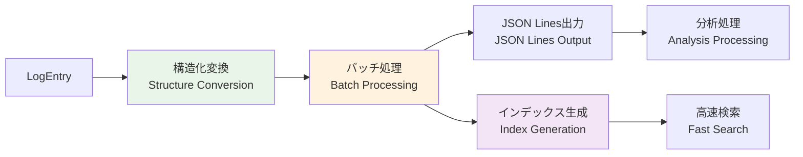
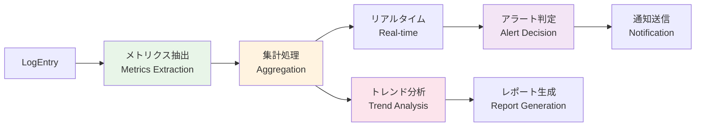
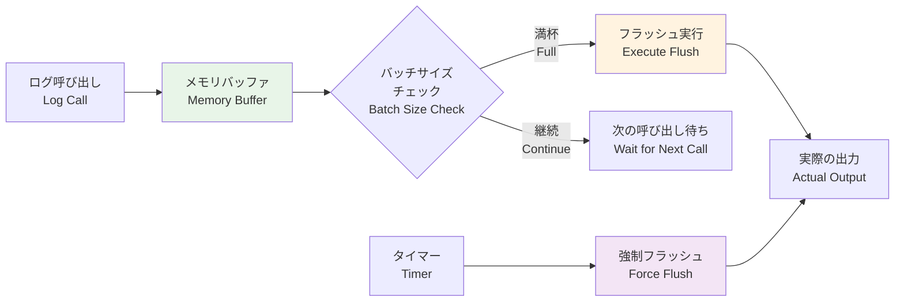
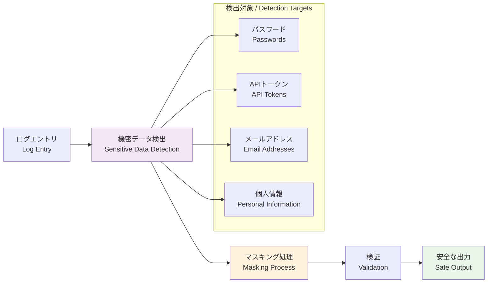
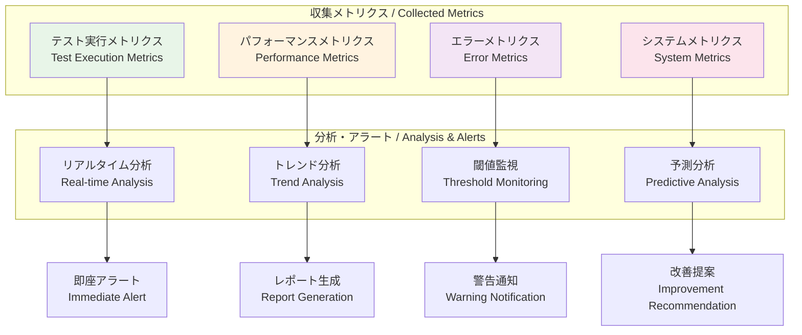

# 🏗️ ログシステム アーキテクチャ設計 / Logging System Architecture Design

## 🎯 設計哲学 / Design Philosophy

### 核心原則 / Core Principles

**🔌 プラガブル設計 / Pluggable Design**
- Emitterパターンによる出力先の動的制御 / Dynamic output control via Emitter pattern
- 実行時設定変更への対応 / Runtime configuration changes support
- 新しい出力先の簡単追加 / Easy addition of new output destinations

**🔒 型安全性 / Type Safety**
- TypeScriptによる完全な型定義 / Complete type definitions with TypeScript
- コンパイル時エラー検出 / Compile-time error detection
- IntelliSenseによる開発支援 / Development support via IntelliSense

**⚡ パフォーマンス重視 / Performance First**
- 非同期処理によるノンブロッキング / Non-blocking via asynchronous processing
- バッチ処理による効率化 / Efficiency through batch processing
- 環境別最適化 / Environment-specific optimization

## 🏗️ アーキテクチャ詳細 / Detailed Architecture

### システム全体図 / System Overview



## 🔌 Emitterパターン設計 / Emitter Pattern Design

### 設計思想 / Design Concept

**🎯 単一責任原則 / Single Responsibility Principle**
- 各Emitterは1つの出力形式に特化 / Each emitter specializes in one output format
- LogManagerは制御のみ、実際の出力はEmitterに委譲 / LogManager controls only, delegates actual output to emitters
- 新しい出力形式の追加が容易 / Easy to add new output formats

### Emitter詳細設計 / Detailed Emitter Design

#### 1. **ConsoleEmitter** - 開発時即座確認 / Immediate Development Feedback



**特徴 / Features:**
- 環境別色付け制御 / Environment-specific color control
- 詳細モードでのコンテキスト展開 / Context expansion in verbose mode
- レベル別出力先分離 / Level-based output destination separation

#### 2. **FileEmitter** - 永続化・ローテーション / Persistence & Rotation



**特徴 / Features:**
- 自動ローテーション（サイズ・日付ベース） / Automatic rotation (size & date-based)
- 古いファイルの自動圧縮 / Automatic compression of old files
- 非同期書き込みによる高性能 / High performance via asynchronous writes

#### 3. **StructuredEmitter** - 分析・検索最適化 / Analytics & Search Optimization



**特徴 / Features:**
- JSON Lines形式での構造化出力 / Structured output in JSON Lines format
- 自動インデックス生成による高速検索 / Fast search via automatic index generation
- バッチ処理による高効率 / High efficiency through batch processing

#### 4. **MetricsEmitter** - 監視・分析 / Monitoring & Analytics



**特徴 / Features:**
- リアルタイムメトリクス収集 / Real-time metrics collection
- 閾値ベースの自動アラート / Automatic threshold-based alerts
- トレンド分析によるパフォーマンス監視 / Performance monitoring via trend analysis

## 🔧 環境別設定戦略 / Environment-Specific Configuration Strategy

### 設計原則 / Design Principles

**📋 環境別設定ルール参照 / Environment Configuration Rules Reference**

環境別の詳細設定は **[📊 logging.mdc](../../.cursor/rules/logging.mdc#環境別設定ルール--environment-configuration-rules)** を参照してください。

For detailed environment-specific configuration, refer to **[📊 logging.mdc](../../.cursor/rules/logging.mdc#環境別設定ルール--environment-configuration-rules)**.

### 設定適用フロー / Configuration Application Flow

```mermaid
graph LR
    Start[アプリケーション開始<br/>Application Start] --> EnvDetect[環境検出<br/>Environment Detection]
    
    EnvDetect --> DefaultConfig[デフォルト設定読み込み<br/>Load Default Config]
    DefaultConfig --> EnvOverride[環境変数オーバーライド<br/>Environment Variable Override]
    EnvOverride --> CustomMerge[カスタム設定マージ<br/>Custom Config Merge]
    
    CustomMerge --> Validate[設定検証<br/>Configuration Validation]
    Validate --> EmitterSetup[Emitterセットアップ<br/>Emitter Setup]
    
    EmitterSetup --> Ready[ログシステム準備完了<br/>Logging System Ready]
    
    style DefaultConfig fill:#e8f5e8
    style EnvOverride fill:#fff3e0
    style CustomMerge fill:#f3e5f5
    style Validate fill:#fce4ec
```



## 🚀 パフォーマンス設計 / Performance Design

### 非同期処理戦略 / Asynchronous Processing Strategy

**🔄 ノンブロッキング設計 / Non-blocking Design**
- ログ出力はメインスレッドをブロックしない / Log output doesn't block main thread
- バッファリングによる書き込み最適化 / Write optimization via buffering
- Promise.allSettledによる並列処理 / Parallel processing via Promise.allSettled

### バッファリング戦略 / Buffering Strategy



### メモリ使用量最適化 / Memory Usage Optimization

**📊 メモリ効率化戦略 / Memory Efficiency Strategy**
- ログエントリの即座解放 / Immediate release of log entries
- 循環参照の防止 / Prevention of circular references
- WeakMap/WeakSetの活用 / Utilization of WeakMap/WeakSet

## 🔒 セキュリティ設計 / Security Design

### 機密データ保護 / Sensitive Data Protection



### マスキング戦略 / Masking Strategy

**📋 セキュリティルール参照 / Security Rules Reference**

詳細なマスキング戦略とセキュリティルールは **[📊 logging.mdc](../../.cursor/rules/logging.mdc#禁止事項--prohibited-practices)** を参照してください。

For detailed masking strategy and security rules, refer to **[📊 logging.mdc](../../.cursor/rules/logging.mdc#禁止事項--prohibited-practices)**.

## 🔍 監視・アラート設計 / Monitoring & Alert Design

### アラート設計原則 / Alert Design Principles

**📊 段階的アラート / Graduated Alerts**
- 情報レベル：ログのみ / Info level: Log only
- 警告レベル：社内通知 / Warning level: Internal notification
- エラーレベル：即座対応 / Error level: Immediate response
- 致命的レベル：緊急対応 / Fatal level: Emergency response

### メトリクス収集戦略 / Metrics Collection Strategy



## 🔄 拡張性設計 / Extensibility Design

### 新Emitter追加パターン / New Emitter Addition Pattern

**🔌 プラグイン機構 / Plugin Mechanism**
- LogEmitterインターフェースの実装 / Implement LogEmitter interface
- LogManagerへの動的追加 / Dynamic addition to LogManager
- 設定ファクトリでの自動認識 / Automatic recognition in config factory

### カスタムEmitterの実装例 / Custom Emitter Implementation Example

```typescript
// カスタムEmitterの実装 / Custom Emitter Implementation
class SlackEmitter implements LogEmitter {
  async emit(entry: LogEntry): Promise<void> {
    if (entry.level >= LogLevel.ERROR) {
      await this.sendToSlack(entry);
    }
  }
  
  private async sendToSlack(entry: LogEntry): Promise<void> {
    // Slack通知の実装 / Slack notification implementation
  }
}

// 使用方法 / Usage
const logger = LogManager.getInstance(config);
logger.addEmitter(new SlackEmitter());
```

## 🎯 今後の拡張計画 / Future Extension Plans

### 予定機能 / Planned Features

**📈 高度な分析機能 / Advanced Analytics**
- 機械学習による異常検知 / Anomaly detection via machine learning
- 自動パフォーマンス最適化提案 / Automatic performance optimization suggestions
- テスト品質メトリクスの自動算出 / Automatic test quality metrics calculation

**🔌 外部連携機能 / External Integration**
- ELK Stack連携 / ELK Stack integration
- Grafana ダッシュボード / Grafana dashboard
- APM ツール連携 / APM tool integration

**🚀 スケーラビリティ / Scalability**
- 分散ログ収集対応 / Distributed log collection support
- クラウドストレージ連携 / Cloud storage integration
- マイクロサービス対応 / Microservices support

---

**📝 アーキテクチャ更新履歴 / Architecture Update History**
- v1.0.0: 初期アーキテクチャ設計 (2025-01-23) / Initial architecture design
- 最終更新 / Last updated: 2025-01-23
