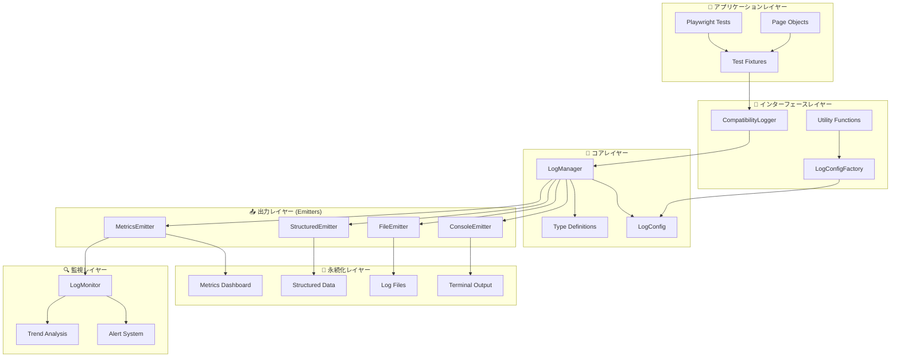
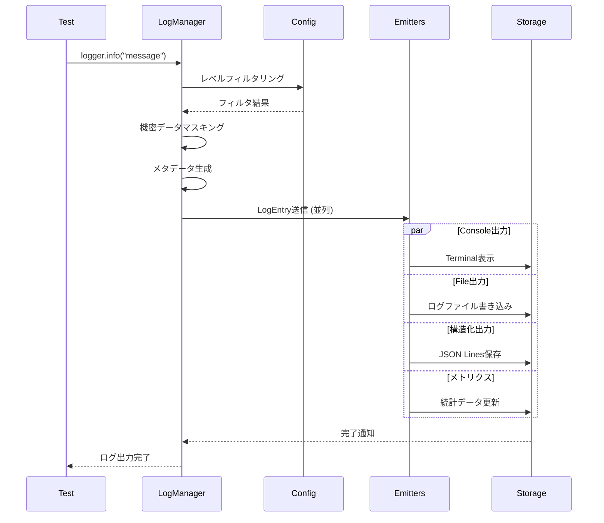

# 🏗️ ログシステム アーキテクチャ設計書

> **日運用対応ログシステム** の設計思想・構造・拡張性

## 🎯 設計思想

### 📐 基本原則

1. **🔧 プラガブル設計**: 出力先を動的に制御可能
2. **⚡ 高性能**: 非同期・バッチ処理による効率化
3. **🔒 セキュリティ**: 機密情報の自動マスキング
4. **🌍 環境対応**: 開発・ステージング・本番の最適化
5. **📊 観測可能性**: 構造化ログによる高度な分析
6. **🚨 運用性**: リアルタイム監視とアラート

### 🎪 アーキテクチャパターン

- **Emitterパターン**: 出力責務の分離
- **Factoryパターン**: 環境別設定の生成
- **Singletonパターン**: LogManagerの一元管理
- **Strategy パターン**: ログレベル・カテゴリ別の動作制御

---

## 🏗️ システム構成

### 📊 全体アーキテクチャ



### 🔄 データフロー詳細



---

## 🧩 コンポーネント詳細

### 🧠 LogManager (中心クラス)

**責務**: ログエントリの作成・分散・制御

#### 主要機能
- **シングルトン管理**: アプリケーション全体での一元制御
- **Emitter管理**: 動的な追加・削除
- **設定管理**: 実行時設定変更対応
- **セキュリティ**: 機密データの自動マスキング

#### 内部構造
```typescript
class LogManager {
  private static instance: LogManager;           // シングルトンインスタンス
  private emitters: LogEmitter[] = [];           // 登録済みEmitter
  private config: LogConfig;                     // 現在の設定
  private correlationId: string;                 // 相関ID
  private sessionId: string;                     // セッションID
  
  // ログレベル別メソッド
  trace() | debug() | info() | warn() | error() | fatal()
  
  // テスト専用メソッド
  startTest() | endTest() | pageAction() | performance() | security()
  
  // 管理メソッド
  addEmitter() | removeEmitter() | flush() | close()
}
```

#### 設計パターン適用
- **Singleton**: インスタンス一元管理
- **Observer**: Emitterへの通知配信
- **Strategy**: ログレベル・カテゴリ別制御

### ⚙️ LogConfigFactory (設定生成)

**責務**: 環境別設定の生成・検証・適用

#### 主要機能
- **環境別デフォルト**: development/staging/production対応
- **環境変数統合**: 実行時設定オーバーライド
- **設定検証**: 必須項目・妥当性チェック
- **Emitter自動構成**: 設定に基づく自動セットアップ

#### 設定階層
```
デフォルト設定
    ↓ (override)
環境変数設定
    ↓ (merge)
カスタム設定
    ↓ (validate)
最終設定
```

### 📤 Emitter System (出力制御)

**責務**: ログエントリの特定形式での出力

#### 共通インターフェース
```typescript
interface LogEmitter {
  emit(entry: LogEntry): Promise<void>;    // 必須: ログ出力
  flush?(): Promise<void>;                 // オプション: バッファフラッシュ
  close?(): Promise<void>;                 // オプション: リソース解放
}
```

#### 各Emitterの特化機能

| Emitter        | 特化機能               | パフォーマンス | 用途           |
| -------------- | ---------------------- | -------------- | -------------- |
| **Console**    | カラー出力・詳細モード | ⭐⭐⭐⭐⭐          | 開発・デバッグ |
| **File**       | ローテーション・圧縮   | ⭐⭐⭐⭐           | 長期保存       |
| **Structured** | インデックス・集計     | ⭐⭐⭐            | データ分析     |
| **Metrics**    | 統計・アラート         | ⭐⭐             | 運用監視       |

---

## 🔒 セキュリティ設計

### 🛡️ 機密データ保護

#### 自動マスキング対象
```typescript
// パスワード関連
password: "secret123" → password: "***"
token: "abc123def" → token: "***" 
apiKey: "sk-1234567" → key: "***"

// メールアドレス
user@example.com → user@***

// カスタムデータ内の機密情報
customData: { secret: "value" } → customData: { secret: "***" }
```

#### マスキング実装
```typescript
private maskSensitiveData(message: string): string {
  return message
    .replace(/password["\s]*[:=]["\s]*[^"\s,}]+/gi, 'password: "***"')
    .replace(/token["\s]*[:=]["\s]*[^"\s,}]+/gi, 'token: "***"')
    .replace(/key["\s]*[:=]["\s]*[^"\s,}]+/gi, 'key: "***"')
    .replace(/(\w+@\w+\.\w+)/g, (email) => email.replace(/@.+/, "@***"));
}
```

### 🔐 環境別セキュリティ

| 環境            | セキュリティレベル | 機密データマスキング | 出力先制限             |
| --------------- | ------------------ | -------------------- | ---------------------- |
| **Development** | 中                 | 有効（推奨）         | コンソール・ファイル   |
| **Staging**     | 高                 | 必須                 | ファイル・構造化ログ   |
| **Production**  | 最高               | 必須                 | 構造化ログ・メトリクス |

---

## ⚡ パフォーマンス設計

### 🚀 最適化手法

#### 1. 非同期処理
```typescript
// 全Emitterに並列送信
await Promise.allSettled(
  this.emitters.map(emitter => emitter.emit(logEntry))
);
```

#### 2. バッファリング
```typescript
// FileEmitter: 10エントリごとに一括書き込み
private writeBuffer: string[] = [];

async emit(entry: LogEntry): Promise<void> {
  this.writeBuffer.push(this.formatLogLine(entry));
  
  if (this.writeBuffer.length >= 10) {
    await this.flush();
  }
}
```

#### 3. バッチ処理
```typescript
// StructuredEmitter: 設定可能なバッチサイズ
private writeBuffer: LogEntry[] = [];

constructor(config: { batchSize: number }) {
  this.batchSize = config.batchSize;
}
```

#### 4. レベルフィルタリング
```typescript
// 設定レベル未満のログは早期リターン
if (level < this.config.level) {
  return;
}
```

### 📊 パフォーマンス指標

| 項目                   | 目標値 | 測定方法             |
| ---------------------- | ------ | -------------------- |
| **ログ出力遅延**       | < 1ms  | 同期処理時間         |
| **バッファフラッシュ** | < 10ms | ファイル書き込み時間 |
| **メモリ使用量**       | < 50MB | プロセス監視         |
| **CPU使用率**          | < 5%   | システム監視         |

---

## 🌍 環境対応設計

### 📋 環境別最適化

#### Development Environment
```typescript
{
  level: LogLevel.DEBUG,           // 詳細情報
  enableConsole: true,             // 即座フィードバック
  enableFile: true,                // ローカル保存
  enableStructured: false,         // オーバーヘッド削減
  enableMetrics: false,            // 簡素化
  sensitiveDataMasking: true       // セキュリティ確保
}
```

#### Staging Environment  
```typescript
{
  level: LogLevel.INFO,            // 適度な詳細
  enableConsole: false,            // 静穏化
  enableFile: true,                // 詳細ログ保存
  enableStructured: true,          // 分析データ収集
  enableMetrics: true,             // 本番準備
  sensitiveDataMasking: true       // セキュリティ強化
}
```

#### Production Environment
```typescript
{
  level: LogLevel.WARN,            // 重要情報のみ
  enableConsole: false,            // パフォーマンス優先
  enableFile: true,                // 障害調査用
  enableStructured: true,          // 完全分析
  enableMetrics: true,             // 運用監視
  sensitiveDataMasking: true       // 最高セキュリティ
}
```

### ⚙️ 環境変数による制御

```bash
# ログレベル制御
export LOG_LEVEL="INFO"

# 出力制御
export LOG_CONSOLE="false"
export LOG_FILE="true"
export LOG_STRUCTURED="true"
export LOG_METRICS="true"

# カスタムディレクトリ
export LOG_FILE_DIR="/var/log/playwright"
```

---

## 🔍 観測可能性設計

### 📊 ログ構造化

#### LogEntry 標準構造
```typescript
interface LogEntry {
  timestamp: string;          // ISO 8601形式
  level: LogLevel;           // 0-5 (TRACE-FATAL)
  category: LogCategory;     // 分類タグ
  message: string;           // 主要メッセージ
  context?: LogContext;      // コンテキスト情報
  metadata: LogMetadata;     // メタデータ
  error?: ErrorInfo;         // エラー詳細
}
```

#### メタデータの充実
```typescript
interface LogMetadata {
  correlationId: string;     // 相関追跡ID
  environment: string;       // 実行環境
  version?: string;          // アプリケーションバージョン
  hostname?: string;         // ホスト名
  processId?: number;        // プロセスID
  threadId?: string;         // スレッドID
}
```

### 🔍 分析・検索最適化

#### インデックス戦略
```typescript
// 高速検索用インデックス
interface LogIndex {
  timestamp: string;         // 時間範囲検索
  level: LogLevel;          // レベル別検索
  category: LogCategory;    // カテゴリ別検索
  testTitle?: string;       // テスト別検索
  offset: number;           // ファイル位置
  length: number;           // データサイズ
}
```

#### クエリ例
```bash
# 特定テストのエラーログ検索
grep '"testTitle":"ログインテスト"' index.jsonl | grep '"level":4'

# 時間範囲でのパフォーマンス分析
cat structured.jsonl | jq 'select(.timestamp >= "2025-01-23T10:00:00Z" and .timestamp <= "2025-01-23T11:00:00Z") | select(.category == "performance")'
```

---

## 📈 拡張性設計

### 🔧 カスタムEmitter開発

#### インターフェース実装
```typescript
export class CustomEmitter implements LogEmitter {
  async emit(entry: LogEntry): Promise<void> {
    // カスタム出力ロジック
    await this.processEntry(entry);
  }
  
  async flush?(): Promise<void> {
    // バッファフラッシュ（必要に応じて）
  }
  
  async close?(): Promise<void> {
    // リソースクリーンアップ（必要に応じて）
  }
}
```

#### 実装例: SlackEmitter
```typescript
export class SlackEmitter implements LogEmitter {
  constructor(
    private webhookUrl: string,
    private minimumLevel: LogLevel = LogLevel.ERROR
  ) {}
  
  async emit(entry: LogEntry): Promise<void> {
    if (entry.level >= this.minimumLevel) {
      await this.sendToSlack(entry);
    }
  }
  
  private async sendToSlack(entry: LogEntry): Promise<void> {
    const payload = {
      text: `${LogLevel[entry.level]}: ${entry.message}`,
      attachments: [{
        color: this.getColor(entry.level),
        fields: [
          { title: "Category", value: entry.category, short: true },
          { title: "Timestamp", value: entry.timestamp, short: true }
        ]
      }]
    };
    
    await fetch(this.webhookUrl, {
      method: 'POST',
      headers: { 'Content-Type': 'application/json' },
      body: JSON.stringify(payload)
    });
  }
}
```

### 📊 新しいメトリクス追加

#### カスタムメトリクス定義
```typescript
interface CustomMetrics {
  // 既存のテストメトリクスを拡張
  testMetrics: TestMetrics & {
    customField: number;
    additionalStats: Record<string, any>;
  };
  
  // 新しいメトリクスカテゴリ
  businessMetrics: {
    userJourneys: number;
    conversionRate: number;
    performanceScore: number;
  };
}
```

### 🌐 外部システム統合

#### ELK Stack統合
```typescript
export class ElasticsearchEmitter implements LogEmitter {
  constructor(private elasticClient: Client) {}
  
  async emit(entry: LogEntry): Promise<void> {
    await this.elasticClient.index({
      index: 'playwright-logs',
      body: entry
    });
  }
}
```

#### Prometheus メトリクス
```typescript
export class PrometheusEmitter implements LogEmitter {
  private registry = new prometheus.Registry();
  private counters = new Map<string, prometheus.Counter>();
  
  async emit(entry: LogEntry): Promise<void> {
    this.updateMetrics(entry);
  }
  
  private updateMetrics(entry: LogEntry): void {
    // Prometheus メトリクス更新
  }
}
```

---

## 🚨 障害設計

### 🛡️ エラーハンドリング

#### Emitter障害時の継続性
```typescript
// 全Emitterに送信、一部失敗でも継続
await Promise.allSettled(
  this.emitters.map(emitter => emitter.emit(logEntry))
);
```

#### グレースフル・デグラデーション
```typescript
try {
  await emitter.emit(logEntry);
} catch (error) {
  // フォールバック: コンソール出力
  console.error('Emitter failed, falling back:', error);
  console.log(JSON.stringify(logEntry));
}
```

### 🔄 復旧メカニズム

#### ファイルロック対応
```typescript
// 複数プロセス対応のファイル書き込み
const lockFile = `${filePath}.lock`;
await this.acquireLock(lockFile);
try {
  await this.writeToFile(data);
} finally {
  await this.releaseLock(lockFile);
}
```

#### ディスク容量不足対応
```typescript
// 古いファイルの自動削除
if (await this.isDiskSpaceLow()) {
  await this.cleanupOldLogs();
}
```

---

## 📊 品質保証

### 🧪 テスト戦略

#### ユニットテスト
- 各Emitterの独立動作確認
- LogManagerの制御ロジック検証
- 設定生成・検証機能のテスト

#### 統合テスト
- 複数Emitterの並行動作確認
- 環境別設定の動作検証
- パフォーマンス測定

#### エンドツーエンドテスト
- 実際のPlaywrightテストでの動作確認
- 長時間実行での安定性検証
- 障害時の復旧動作確認

### 📋 品質メトリクス

| 品質項目             | 目標値         | 測定方法         |
| -------------------- | -------------- | ---------------- |
| **テストカバレッジ** | > 90%          | Jest coverage    |
| **パフォーマンス**   | < 1ms ログ出力 | ベンチマーク     |
| **メモリリーク**     | 0件            | 長時間実行テスト |
| **障害復旧**         | < 1秒          | エラー注入テスト |

---

## 🔮 将来構想

### 🚀 Phase 2: 高度分析機能

#### 機械学習統合
- **異常検知**: ログパターンからの自動異常検知
- **予測分析**: テスト失敗の事前予測
- **自動分類**: エラーの自動カテゴライズ

#### 分散ログ収集
- **Fluentd統合**: ログの中央集約
- **Kafka連携**: リアルタイムストリーミング
- **マイクロサービス対応**: 複数サービスのログ統合

### 📊 Phase 3: 可視化・ダッシュボード

#### リアルタイム可視化
- **Grafana連携**: メトリクスダッシュボード
- **Kibana統合**: ログ検索・分析UI
- **カスタムダッシュボード**: プロジェクト固有表示

#### 自動レポート
- **定期レポート**: 週次・月次の自動生成
- **品質指標**: テスト品質の定量評価
- **トレンド分析**: 長期的なパフォーマンス変化

---

## 🎯 まとめ

### 🏆 設計の優位性

1. **🔧 拡張性**: 新しいEmitterを簡単に追加可能
2. **⚡ 性能**: 非同期・並列処理による高速化
3. **🔒 安全性**: 機密データの自動保護
4. **🌍 適応性**: 環境別の最適化対応
5. **🔍 観測性**: 構造化ログによる高度な分析
6. **🚨 堅牢性**: 障害時の継続動作保証

### 📈 期待効果

- **開発効率 30%向上**: 即座のフィードバックによる問題発見の迅速化
- **障害調査時間 50%削減**: 構造化ログによる高速な原因特定
- **運用コスト 40%削減**: 自動監視・アラートによる工数削減
- **品質向上 20%**: 継続的なメトリクス監視による品質維持

この設計により、小規模な開発から大規模な本番運用まで対応できる、スケーラブルで高品質なログシステムが実現されています。
