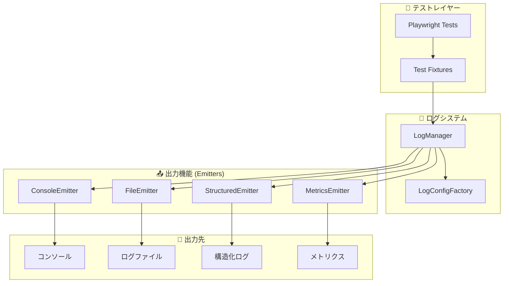

# 📚 ログシステム ドキュメント索引

> **日運用対応ログシステム** の完全ドキュメント集

## 🚀 クイックナビゲーション

| 目的                             | ドキュメント                                                | 説明                           |
| -------------------------------- | ----------------------------------------------------------- | ------------------------------ |
| **🏃‍♂️ すぐに始めたい**             | [README.md](./README.md)                                    | システム概要・クイックスタート |
| **🔧 実装・統合したい**           | [Integration Guide](./integration/VRT-Integration-Guide.md) | VRTテストとの統合方法          |
| **📈 移行を計画したい**           | [Migration Guide](./examples/migration-guide.ts)            | 既存システムからの移行例       |
| **🔍 監視・運用したい**           | [Monitoring Setup](./monitoring/setup.ts)                   | 本番運用での監視設定           |
| **🎯 個別機能を知りたい**         | [Emitters Guide](#emitters-詳細ガイド)                      | 各出力機能の詳細               |
| **🏗️ アーキテクチャを理解したい** | [Architecture](#システムアーキテクチャ)                     | 設計思想と全体構造             |

---

## 📁 ドキュメント構造

```
tests/utils/logging/
├── 📋 DOCUMENTATION-INDEX.md     # このファイル（全体索引）
├── 📖 README.md                  # ★メインドキュメント
├── 🔧 API-REFERENCE.md          # API詳細リファレンス
├── 🏗️ ARCHITECTURE.md           # システム設計書
├── emitters/
│   ├── 📝 EMITTERS-GUIDE.md     # Emitters統合ガイド
│   ├── ConsoleEmitter.ts
│   ├── FileEmitter.ts
│   ├── StructuredEmitter.ts
│   └── MetricsEmitter.ts
├── examples/
│   ├── 🔄 migration-guide.ts    # 移行実装例
│   └── 📊 best-practices.md     # ベストプラクティス集
├── integration/
│   └── 🎯 VRT-Integration-Guide.md # VRT統合ガイド
└── monitoring/
    ├── 🔍 setup.ts              # 監視システム
    └── 📊 MONITORING-GUIDE.md   # 運用監視ガイド
```

---

## 🎯 用途別クイックガイド

### 🚀 **初めて使用する場合**
1. [README.md - システム概要](./README.md#システム概要) で全体像を把握
2. [README.md - クイックスタート](./README.md#クイックスタート) で基本使用法を確認
3. [Migration Guide](./examples/migration-guide.ts) で実装例を参考に導入

### 🔧 **既存プロジェクトに統合する場合**
1. [VRT Integration Guide](./integration/VRT-Integration-Guide.md) で統合パターンを確認
2. [Migration Guide](./examples/migration-guide.ts) で段階的移行を実施
3. [Best Practices](./examples/best-practices.md) で最適化を実施

### 🏗️ **カスタマイズ・拡張する場合**  
1. [ARCHITECTURE.md](./ARCHITECTURE.md) でシステム設計を理解
2. [Emitters Guide](./emitters/EMITTERS-GUIDE.md) で出力機能を把握
3. [API Reference](./API-REFERENCE.md) で詳細なAPIを確認

### 🔍 **本番運用・監視する場合**
1. [Monitoring Guide](./monitoring/MONITORING-GUIDE.md) で監視設定を実施
2. [README.md - 環境別設定](./README.md#環境別設定) で本番最適化
3. [Troubleshooting](./README.md#トラブルシューティング) で問題対応

---

## 📊 システムアーキテクチャ

### 🏗️ **全体構成**


### 🔄 **データフロー**
1. **テスト実行** → LogManager がログエントリを作成
2. **設定適用** → LogConfigFactory が環境別設定を生成
3. **出力処理** → 各Emitter が並列でログを出力
4. **永続化** → ファイル・構造化データ・メトリクスとして保存

---

## 📚 Emitters 詳細ガイド

| Emitter               | 用途             | 設定例                         | ドキュメント                                           |
| --------------------- | ---------------- | ------------------------------ | ------------------------------------------------------ |
| **ConsoleEmitter**    | リアルタイム確認 | 開発環境での即座フィードバック | [詳細](./emitters/EMITTERS-GUIDE.md#consoleemitter)    |
| **FileEmitter**       | ログファイル出力 | 日次ローテーション・圧縮       | [詳細](./emitters/EMITTERS-GUIDE.md#fileemitter)       |
| **StructuredEmitter** | 構造化ログ       | JSON Lines・検索・集計         | [詳細](./emitters/EMITTERS-GUIDE.md#structuredemitter) |
| **MetricsEmitter**    | 運用メトリクス   | パフォーマンス・アラート       | [詳細](./emitters/EMITTERS-GUIDE.md#metricsemitter)    |

---

## 🏷️ **ドキュメントタグ**

各ドキュメントには以下のタグで分類：

- 🚀 **Beginner**: 初心者向け・導入時
- 🔧 **Integration**: 統合・実装時  
- 🏗️ **Advanced**: 上級者向け・カスタマイズ
- 🔍 **Operations**: 運用・監視時
- 📊 **Reference**: リファレンス・API詳細

---

## 📞 **サポート・更新履歴**

### 🆘 **トラブル時の対応順序**
1. [README.md - トラブルシューティング](./README.md#トラブルシューティング)
2. [GitHub Issues](../../../issues) でバグ報告
3. [Migration Guide](./examples/migration-guide.ts) で実装例確認

### 📈 **ドキュメント更新履歴**
- **v1.1.0** (2025-01-23): ドキュメント索引・アーキテクチャ図追加
- **v1.0.0** (2025-01-23): 初期システム・メインドキュメント作成

---

> 💡 **Tips**: 特定の用途がある場合は、上記の「用途別クイックガイド」から最適なドキュメントをお選びください。
