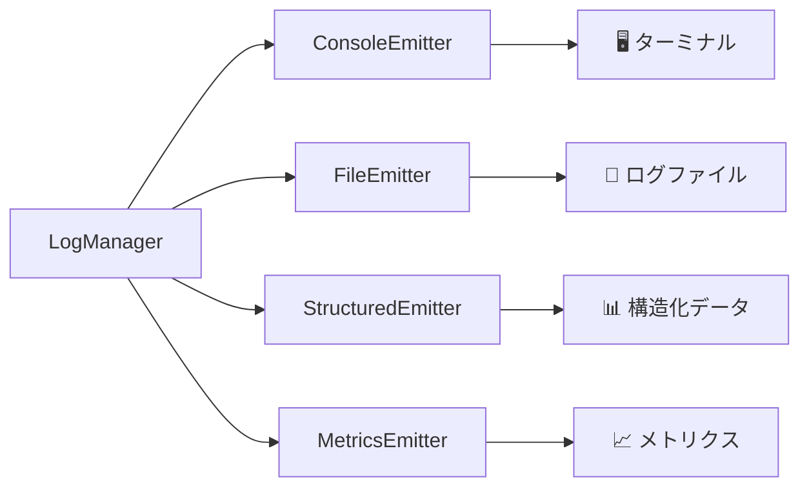

# 📤 Emitters 完全ガイド

> **ログシステムの出力機能** - 4つのEmitterの詳細仕様とベストプラクティス

## 🎯 概要

Emitterはログエントリを特定の形式・場所に出力する責務を持つプラガブルコンポーネントです。各Emitterは独立して動作し、同時に複数のEmitterを使用することで多様な出力形式を実現できます。

### 🏗️ Emitter アーキテクチャ



---

## 🖥️ ConsoleEmitter

**用途**: 開発時の即座なフィードバック・デバッグ

### ✨ 主要機能
- **カラー出力**: ログレベル別の色分け表示
- **詳細モード**: コンテキスト情報の展開表示  
- **レベル別出力**: console.info/warn/error の適切な使い分け
- **スタックトレース**: エラー発生時の詳細情報

### ⚙️ 設定オプション

```typescript
const consoleEmitter = new ConsoleEmitter({
  colorEnabled: true,    // カラー出力の有効化
  verbose: false         // 詳細情報の表示
});
```

### 📋 設定例

#### 開発環境（推奨）
```typescript
new ConsoleEmitter({
  colorEnabled: true,   // カラフルな出力で視認性向上
  verbose: true         // デバッグ情報を詳細表示
});
```

#### CI/CD環境
```typescript
new ConsoleEmitter({
  colorEnabled: false,  // ANSI色コードを無効化
  verbose: false        // 簡潔な出力でログ量削減
});
```

### 🎨 出力例

#### 通常モード
```
14:30:15 [INFO] [test_execution] 🚀 テスト開始: ログインテスト
14:30:17 [WARN] [performance] ⚡ パフォーマンス: ページロード遅延 - 3200ms
14:30:18 [ERROR] [error_handling] ❌ ログイン失敗: 認証エラー
```

#### 詳細モード（verbose: true）
```
14:30:15 [INFO] [test_execution] 🚀 テスト開始: ログインテスト
Context:
  testInfo: { title: "ログインテスト", file: "login.spec.ts" }
  browser: { name: "chromium", version: "118.0" }
  performance: { duration: 1200 }
```

### 💡 ベストプラクティス

#### ✅ 推奨設定
- **開発時**: verbose: true でコンテキスト確認
- **CI/CD**: colorEnabled: false でログ出力最適化
- **デバッグ時**: LogLevel.DEBUG 以上で詳細情報取得

#### ❌ 避けるべき設定  
- 本番環境でのverbose: true（情報過多）
- CI環境でのcolorEnabled: true（不要なANSI文字）

---

## 📁 FileEmitter

**用途**: 永続的なログ保存・日次ローテーション・本番運用

### ✨ 主要機能
- **自動ローテーション**: ファイルサイズ・日付ベース
- **圧縮保存**: 古いログファイルの自動gzip圧縮
- **バッファリング**: 効率的な書き込みとパフォーマンス最適化
- **JSON Lines形式**: 構造化データとして保存

### ⚙️ 設定オプション

```typescript
const fileEmitter = new FileEmitter({
  directory: "test-results/logs",    // 出力ディレクトリ
  maxFileSize: 50,                   // ファイル最大サイズ（MB）
  maxFiles: 30,                      // 保持ファイル数
  compress: true,                    // 古いファイルの圧縮
  filePattern: "test-{date}.log"     // ファイル名パターン
});
```

### 📁 ファイル構造

```
test-results/logs/
├── test-2025-01-23.log           # 今日のログ（アクティブ）
├── test-2025-01-22.log.gz        # 昨日のログ（圧縮済み）
├── test-2025-01-21.log.gz        # 一昨日のログ（圧縮済み）
└── ...
```

### 🔄 ローテーション戦略

#### サイズベース
```typescript
// 50MBに達したら新しいファイルにローテーション
{
  maxFileSize: 50,
  filePattern: "test-{date}-{sequence}.log"
}

// 結果: test-2025-01-23-001.log, test-2025-01-23-002.log...
```

#### 日付ベース  
```typescript
// 日付が変わったら新しいファイルに切り替え
{
  filePattern: "test-{date}.log"
}

// 結果: test-2025-01-23.log, test-2025-01-24.log...
```

### 📊 出力形式（JSON Lines）

```json
{"timestamp":"2025-01-23T14:30:15.789Z","level":"INFO","category":"test_execution","message":"テスト開始","correlationId":"abc123","context":{"testInfo":{"title":"ログインテスト"}},"metadata":{"environment":"staging"}}
{"timestamp":"2025-01-23T14:30:17.124Z","level":"ERROR","category":"error_handling","message":"ログイン失敗","correlationId":"abc123","error":{"name":"AuthError","message":"認証失敗","stack":"..."}}
```

### 🛠️ 環境別設定

#### 開発環境
```typescript
new FileEmitter({
  directory: "dev-logs",
  maxFileSize: 10,      // 小さめのファイル
  maxFiles: 7,          // 1週間分
  compress: false       // 圧縮なし（即座確認用）
});
```

#### 本番環境
```typescript
new FileEmitter({
  directory: "prod-logs",
  maxFileSize: 100,     // 大きなファイル
  maxFiles: 90,         // 3ヶ月分
  compress: true        // ストレージ効率化
});
```

### 💡 ベストプラクティス

#### ✅ 推奨設定
- **ディスク容量監視**: 定期的な容量チェック
- **適切なローテーション**: 環境に応じたファイルサイズ設定
- **圧縮有効化**: 長期保存時のストレージ効率化

#### ❌ 避けるべき設定
- maxFiles過大設定（ディスク容量圧迫）
- 開発環境での過度な圧縮（即座確認阻害）

---

## 📊 StructuredEmitter  

**用途**: 構造化ログ・高速検索・データ分析・レポート生成

### ✨ 主要機能
- **JSON Lines出力**: 効率的な行指向データ形式
- **インデックス生成**: 高速検索のためのメタデータ
- **集計機能**: リアルタイム統計データ
- **バッチ処理**: 高パフォーマンスな一括書き込み

### ⚙️ 設定オプション

```typescript
const structuredEmitter = new StructuredEmitter({
  directory: "test-results/logs/structured",  // 出力ディレクトリ
  enableIndexing: true,                       // インデックス生成
  enableAggregation: true,                    // 集計データ生成
  batchSize: 50,                             // バッチサイズ
  flushInterval: 30                          // フラッシュ間隔（秒）
});
```

### 📁 出力ファイル構造

```
test-results/logs/structured/
├── structured-2025-01-23.jsonl              # メインログ
├── index-2025-01-23.jsonl                   # 検索インデックス
└── aggregation-2025-01-23.jsonl             # 集計データ
```

### 🔍 インデックス機能

#### インデックスエントリ例
```json
{"timestamp":"2025-01-23T14:30:15.789Z","level":2,"category":"test_execution","testTitle":"ログインテスト","offset":1024,"length":256}
{"timestamp":"2025-01-23T14:30:17.124Z","level":4,"category":"error_handling","testTitle":"ログインテスト","offset":1280,"length":189}
```

#### 高速検索の実現
```bash
# 特定テストのログを高速抽出
grep '"testTitle":"ログインテスト"' index-2025-01-23.jsonl

# エラーレベルのログのみ抽出  
grep '"level":4' index-2025-01-23.jsonl
```

### 📈 集計機能

#### 集計データ例
```json
{
  "timestamp": "2025-01-23T15:00:00.000Z",
  "period": "1h",
  "stats": {
    "total": 245,
    "byLevel": { "2": 200, "3": 30, "4": 15 },
    "byCategory": { "test_execution": 180, "performance": 45, "error_handling": 20 },
    "errorRate": 6.1,
    "averageTestDuration": 2400,
    "failedTests": ["ログインテスト", "商品検索テスト"]
  }
}
```

### ⚡ パフォーマンス最適化

#### バッチ処理設定
```typescript
// 高負荷環境向け
{
  batchSize: 100,        // 大きなバッチで効率化
  flushInterval: 60      // 長い間隔で書き込み削減
}

// 低遅延環境向け  
{
  batchSize: 10,         // 小さなバッチで即座反映
  flushInterval: 5       // 短い間隔で即座書き込み
}
```

### 🔍 検索・分析例

#### jq を使用した分析
```bash
# エラー率の計算
cat structured-2025-01-23.jsonl | jq -r 'select(.level >= 4) | .message' | wc -l

# テスト別の実行時間分析
cat structured-2025-01-23.jsonl | jq -r 'select(.context.performance.duration) | "\(.context.testInfo.title): \(.context.performance.duration)ms"'

# 時間別エラー数の集計
cat structured-2025-01-23.jsonl | jq -r 'select(.level >= 4) | .timestamp[0:13]' | sort | uniq -c
```

### 💡 ベストプラクティス

#### ✅ 推奨設定
- **適切なバッチサイズ**: 環境に応じた調整
- **インデックス活用**: 大量ログでの高速検索
- **集計データ利用**: リアルタイム監視・レポート生成

#### ❌ 避けるべき設定
- 過小なバッチサイズ（パフォーマンス低下）
- インデックス無効化（検索性能低下）

---

## 📈 MetricsEmitter

**用途**: 運用メトリクス・性能監視・傾向分析・自動アラート

### ✨ 主要機能
- **リアルタイムメトリクス**: テスト実行統計の即座計算
- **傾向分析**: パフォーマンス・エラー率の変化検知
- **自動アラート**: 閾値ベースの障害検知
- **ブラウザ別統計**: Chromium/Firefox/WebKit別の詳細分析

### ⚙️ 設定オプション

```typescript
const metricsEmitter = new MetricsEmitter({
  directory: "test-results/metrics",        // 出力ディレクトリ
  enableRealTimeMetrics: true,              // リアルタイム計算
  enableTrendAnalysis: true,                // 傾向分析
  flushInterval: 30,                        // フラッシュ間隔（秒）
  retentionDays: 90,                       // データ保持期間
  alertThresholds: {
    errorRate: 5,                          // エラー率閾値（%）
    avgResponseTime: 3000,                 // 応答時間閾値（ms）
    failureRate: 10                        // 失敗率閾値（%）
  }
});
```

### 📊 メトリクスの種類

#### 1. テスト実行メトリクス
```json
{
  "testMetrics": {
    "totalTests": 245,
    "passedTests": 230,
    "failedTests": 12,
    "skippedTests": 3,
    "avgDuration": 2400,
    "maxDuration": 8500,
    "minDuration": 120
  }
}
```

#### 2. パフォーマンスメトリクス
```json
{
  "performanceMetrics": {
    "avgResponseTime": 1800,
    "maxResponseTime": 5200,
    "avgMemoryUsage": 256,
    "networkRequests": 1240
  }
}
```

#### 3. エラーメトリクス
```json
{
  "errorMetrics": {
    "totalErrors": 25,
    "errorRate": 10.2,
    "criticalErrors": 3,
    "warningCount": 48,
    "topErrors": [
      { "message": "認証エラー", "count": 12 },
      { "message": "タイムアウト", "count": 8 }
    ]
  }
}
```

#### 4. ブラウザ別メトリクス
```json
{
  "browserMetrics": {
    "chromium": 180,
    "firefox": 45,
    "webkit": 20
  }
}
```

### 📈 傾向分析

#### トレンド検知
```json
{
  "trends": {
    "errorRateTrend": "increasing",      // 増加傾向
    "performanceTrend": "stable",        // 安定
    "testCountTrend": "decreasing"       // 減少傾向
  }
}
```

#### 傾向分析アルゴリズム
- **移動平均**: 過去7日間の平均値で基準作成
- **変化率計算**: 前日比・前週比での変化検知
- **異常値検出**: 統計的外れ値の自動検知

### 🚨 自動アラート

#### アラート設定例
```typescript
{
  alertThresholds: {
    errorRate: 5,           // エラー率5%超過で警告
    avgResponseTime: 3000,  // 平均応答時間3秒超過で警告  
    failureRate: 10         // テスト失敗率10%超過で警告
  }
}
```

#### アラート出力例
```json
{
  "timestamp": "2025-01-23T15:30:00.000Z",
  "type": "error_rate",
  "severity": "warning",
  "message": "エラー率が閾値を超過しました",
  "value": 7.2,
  "threshold": 5.0,
  "context": {
    "period": "last_1h",
    "totalTests": 120,
    "errorCount": 9
  }
}
```

### 📊 出力ファイル

```
test-results/metrics/
├── snapshots.jsonl                       # メトリクススナップショット
├── alerts.jsonl                          # アラート履歴
├── trends-2025-01-23.jsonl               # 傾向分析データ
└── browser-stats-2025-01-23.jsonl        # ブラウザ別統計
```

### 🔄 データ活用例

#### ダッシュボード連携
```bash
# 過去24時間のエラー率
cat snapshots.jsonl | jq -r 'select(.timestamp > "2025-01-22T15:00:00Z") | .errorMetrics.errorRate' | awk '{sum+=$1; count++} END {print sum/count}'

# アラート発生頻度
cat alerts.jsonl | jq -r 'select(.timestamp > "2025-01-22T00:00:00Z") | .type' | sort | uniq -c
```

#### レポート生成
```bash
# 週次パフォーマンスレポート
cat snapshots.jsonl | jq -r '.performanceMetrics | "\(.avgResponseTime),\(.maxResponseTime)"' > weekly-performance.csv
```

### 💡 ベストプラクティス

#### ✅ 推奨設定
- **適切な閾値設定**: 環境に応じたアラート調整
- **トレンド分析活用**: 長期的なパフォーマンス監視
- **定期レポート**: 週次・月次での傾向把握

#### ❌ 避けるべき設定
- 過敏な閾値（アラート過多）
- データ保持期間不足（傾向分析困難）

---

## 🔄 複数Emitterの組み合わせ

### 🌟 環境別推奨構成

#### 開発環境
```typescript
// 即座フィードバック重視
logManager.addEmitter(new ConsoleEmitter({ 
  colorEnabled: true, 
  verbose: true 
}));

logManager.addEmitter(new FileEmitter({
  directory: "dev-logs",
  maxFileSize: 10,
  compress: false
}));
```

#### ステージング環境  
```typescript
// 本番相当のデータ収集
logManager.addEmitter(new FileEmitter({
  directory: "staging-logs",
  maxFileSize: 50,
  compress: true
}));

logManager.addEmitter(new StructuredEmitter({
  directory: "staging-logs/structured",
  enableIndexing: true,
  enableAggregation: true
}));

logManager.addEmitter(new MetricsEmitter({
  directory: "staging-metrics",
  enableRealTimeMetrics: true,
  enableTrendAnalysis: true
}));
```

#### 本番環境
```typescript
// 完全な監視・分析体制
logManager.addEmitter(new FileEmitter({
  directory: "prod-logs",
  maxFileSize: 100,
  maxFiles: 90,
  compress: true
}));

logManager.addEmitter(new StructuredEmitter({
  directory: "prod-logs/structured", 
  enableIndexing: true,
  enableAggregation: true,
  batchSize: 100,
  flushInterval: 60
}));

logManager.addEmitter(new MetricsEmitter({
  directory: "prod-metrics",
  enableRealTimeMetrics: true,
  enableTrendAnalysis: true,
  retentionDays: 180,
  alertThresholds: {
    errorRate: 2,        // 本番では厳格
    avgResponseTime: 2000,
    failureRate: 5
  }
}));
```

---

## 🛠️ カスタムEmitterの作成

### 📐 基本実装

```typescript
import { LogEmitter, LogEntry } from "../types";

export class CustomEmitter implements LogEmitter {
  async emit(entry: LogEntry): Promise<void> {
    // カスタム出力ロジック
    await this.processLogEntry(entry);
  }

  async flush?(): Promise<void> {
    // バッファフラッシュ（オプション）
  }

  async close?(): Promise<void> {
    // リソースクリーンアップ（オプション）
  }

  private async processLogEntry(entry: LogEntry): Promise<void> {
    // 独自の出力処理を実装
  }
}
```

### 💡 カスタムEmitter例

#### SlackEmitter
```typescript
export class SlackEmitter implements LogEmitter {
  constructor(private webhookUrl: string) {}

  async emit(entry: LogEntry): Promise<void> {
    if (entry.level >= LogLevel.ERROR) {
      await this.sendToSlack(entry);
    }
  }

  private async sendToSlack(entry: LogEntry): Promise<void> {
    // Slack通知の実装
  }
}
```

#### DatabaseEmitter
```typescript
export class DatabaseEmitter implements LogEmitter {
  constructor(private dbConnection: any) {}

  async emit(entry: LogEntry): Promise<void> {
    await this.saveToDatabase(entry);
  }

  private async saveToDatabase(entry: LogEntry): Promise<void> {
    // データベース保存の実装
  }
}
```

---

## 📚 まとめ

### 🎯 Emitter選択指針

| 用途             | 推奨Emitter       | 理由                   |
| ---------------- | ----------------- | ---------------------- |
| **開発デバッグ** | ConsoleEmitter    | 即座な確認・カラー表示 |
| **長期保存**     | FileEmitter       | ローテーション・圧縮   |
| **データ分析**   | StructuredEmitter | 検索・集計最適化       |
| **運用監視**     | MetricsEmitter    | アラート・傾向分析     |

### ⚡ パフォーマンス比較

| Emitter    | 処理速度 | メモリ使用量 | 機能性 | 適用場面           |
| ---------- | -------- | ------------ | ------ | ------------------ |
| Console    | ⭐⭐⭐⭐⭐    | ⭐⭐⭐⭐⭐        | ⭐⭐⭐    | 開発・デバッグ     |
| File       | ⭐⭐⭐⭐     | ⭐⭐⭐⭐         | ⭐⭐⭐⭐   | 一般的な運用       |
| Structured | ⭐⭐⭐      | ⭐⭐⭐          | ⭐⭐⭐⭐⭐  | 分析・レポート     |
| Metrics    | ⭐⭐       | ⭐⭐           | ⭐⭐⭐⭐⭐  | 運用監視・アラート |

### 🎉 最適な組み合わせ

**最も一般的な構成**:
```typescript
// 開発環境
ConsoleEmitter + FileEmitter

// 本番環境  
FileEmitter + StructuredEmitter + MetricsEmitter
```

これにより、即座性・永続性・分析性・監視性のすべてを兼ね備えた包括的なログシステムが実現できます。
