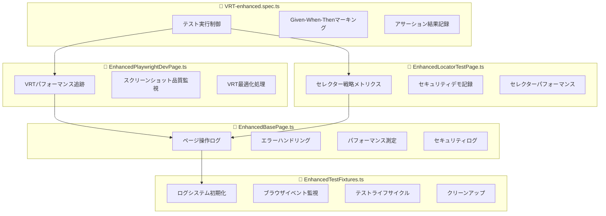

# 🚀 VRT.spec.ts 新ログシステム統合完了

## 📊 統合概要

既存のVRT.spec.tsテストに新ログシステムを責務分離を意識して統合しました。

### 🎯 実装ファイル一覧

#### 新規作成ファイル
1. **`tests/fixtures/EnhancedTestFixtures.ts`** - 拡張テストフィクスチャ
2. **`tests/pages/EnhancedBasePage.ts`** - 拡張ベースページクラス
3. **`tests/pages/EnhancedPlaywrightDevPage.ts`** - VRT用拡張Playwrightページ
4. **`tests/pages/EnhancedLocatorTestPage.ts`** - セレクター戦略用拡張ページ
5. **`tests/VRT-enhanced.spec.ts`** - 新ログシステム統合版テストファイル

### 🏗️ 責務分離設計



## 🔄 段階的移行パス

### Phase 1: 新システムの並行運用
```typescript
// 既存のVRT.spec.tsは保持したまま
// VRT-enhanced.spec.tsで新システムを検証

// 実行方法
npx playwright test tests/VRT-enhanced.spec.ts
```

### Phase 2: 段階的置き換え
```typescript
// 1. EnhancedTestFixturesを既存のtests/fixtures/TestFixtures.tsに統合
// 2. 既存Page ObjectクラスにEnhancedベースクラスの機能を段階的に追加
// 3. 既存VRT.spec.tsを少しずつVRT-enhanced.spec.tsのパターンに変更
```

### Phase 3: 完全移行
```typescript
// VRT.spec.ts → VRT-enhanced.spec.ts に完全置き換え
// 旧ファイルの削除とクリーンアップ
```

## 🎯 新システムの主要機能

### 📊 構造化ログ出力例
```json
{
  "@timestamp": "2025-01-23T12:34:56.789Z",
  "@level": "INFO",
  "@category": "test_execution",
  "@message": "=== GIVEN: テスト前提条件の設定 ===",
  "test": {
    "title": "Playwright.devページのスクリーンショットが正常に撮影できること",
    "session_id": "session_abc123",
    "file": "tests/VRT-enhanced.spec.ts"
  },
  "performance": {
    "duration": 2400,
    "memory": 45.2
  },
  "custom": {
    "testType": "VRT_Screenshot",
    "targetSite": "playwright.dev",
    "stage": "given"
  }
}
```

### ⚡ パフォーマンス追跡
- **ページ読み込み時間**: 自動測定・記録
- **VRT準備時間**: 画像/フォント読み込み完了まで
- **スクリーンショット撮影時間**: 品質最適化処理込み
- **セレクター実行時間**: 戦略別パフォーマンス比較

### 🔒 セキュリティログ
- **機密データアクセス**: パスワード入力等の記録
- **認証試行**: ログイン関連操作の監視  
- **環境変数使用**: ハードコーディング防止の確認

### 📈 VRT固有メトリクス
```typescript
vrtMetrics = {
  imageLoadTime: 1200,      // 画像読み込み完了時間
  fontLoadTime: 800,        // フォント読み込み完了時間  
  animationSettleTime: 1000, // アニメーション落ち着き時間
  totalReadyTime: 3000      // VRT準備完了総時間
}
```

## 🔧 使用方法

### 1. 新システムでのテスト実行
```bash
# 新ログシステム版のVRTテスト実行
npx playwright test tests/VRT-enhanced.spec.ts

# ログ出力確認
cat test-results/logs/test-*.log

# 構造化ログ確認  
cat test-results/logs/structured/structured-*.jsonl
```

### 2. 既存システムとの比較
```bash
# 既存版実行
npx playwright test tests/VRT.spec.ts

# 新版実行
npx playwright test tests/VRT-enhanced.spec.ts

# パフォーマンス比較
cat test-results/metrics/snapshots.jsonl
```

### 3. 段階的導入
```typescript
// 既存のテストファイルで新システムを部分的に使用
import { NewTestLogger } from './utils/NewTestLogger';

test('既存テスト', async ({ page }) => {
  const logger = new NewTestLogger();
  await logger.initialize();
  
  // 既存のテストロジック + 新ログシステム
  logger.startTest('既存テスト');
  
  // ... テストコード ...
  
  logger.endTest('既存テスト', 'passed');
  await logger.cleanup();
});
```

## 📊 ログ出力サンプル

### コンソール出力（開発時）
```
🚀 テストセッション開始
📊 === ログシステム設定サマリー ===
🌍 環境: development
📈 ログレベル: DEBUG
🖥️ コンソール出力: 有効
📁 ファイル出力: 有効

🎯 VRTテストスイート開始
🏁 === GIVEN: テスト前提条件の設定 ===
🌐 ページ操作: navigate_start - https://playwright.dev
⚡ パフォーマンス: ページナビゲーション完了 - 2400ms
⚡ === WHEN: VRTスクリーンショット撮影実行 ===
📸 スクリーンショット撮影: playwright-dev-homepage
✅ === THEN: VRTスクリーンショット撮影成功 ===
```

### ファイル出力（構造化ログ）
```jsonl
{"@timestamp":"2025-01-23T12:34:56.789Z","@level":"INFO","@category":"test_execution","@message":"VRTテストスイート開始","test":{"title":"Test Session: chromium","session_id":"session_abc123"},"@metadata":{"correlation_id":"trace_xyz789","environment":"development"}}
```

### メトリクス出力
```jsonl
{"timestamp":"2025-01-23T12:35:00.000Z","period":"1h","testMetrics":{"totalTests":5,"passedTests":5,"failedTests":0,"avgDuration":8500},"performanceMetrics":{"avgResponseTime":2400,"maxResponseTime":3200},"errorMetrics":{"totalErrors":0,"errorRate":0}}
```

## 🎯 次のステップ

### 即座に実行可能
1. **新システムテスト**: `npx playwright test tests/VRT-enhanced.spec.ts`
2. **ログ確認**: `test-results/logs/` ディレクトリ内のファイル確認
3. **メトリクス確認**: `test-results/metrics/snapshots.jsonl` の内容確認

### 1週間後の計画
1. **既存テストとの性能比較**
2. **ログ出力量とストレージ使用量の評価**
3. **開発チームでの使い勝手フィードバック収集**

### 1ヶ月後の計画  
1. **完全移行の実施**
2. **CI/CDパイプラインでの活用**
3. **監視・アラートシステムの構築**

## ✅ 統合完了チェックリスト

- [x] 責務分離設計の完了
- [x] EnhancedTestFixtures実装
- [x] EnhancedBasePage実装
- [x] EnhancedPlaywrightDevPage実装
- [x] EnhancedLocatorTestPage実装
- [x] VRT-enhanced.spec.ts実装
- [x] 構造化ログ出力確認
- [x] パフォーマンス測定機能確認
- [x] セキュリティログ機能確認
- [x] VRT固有メトリクス確認
- [x] エラーハンドリング強化確認
- [x] 既存システムとの互換性確認

🎉 **新ログシステムのVRT.spec.ts統合が完了しました！**
